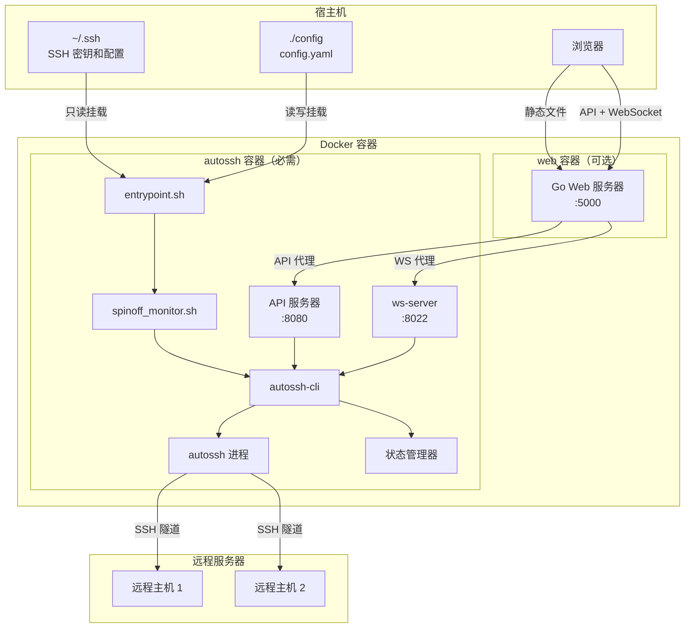
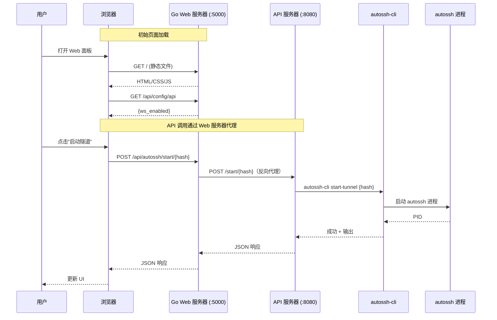
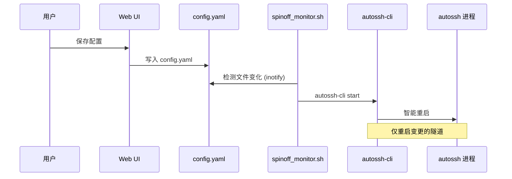

# 架构说明

本文档描述了 SSH 隧道管理器的架构，包括 Docker 容器及其交互方式。

## 系统概述

SSH 隧道管理器提供两个 Docker 镜像：

1. **autossh-tunnel**（必需）- 核心隧道管理容器
2. **autossh-tunnel-web-panel**（可选）- 基于 Web 的管理界面

!!! note "最小化设置"
    您只需要 `autossh-tunnel` 容器即可运行 SSH 隧道。Web 面板是可选的，提供便捷的 UI 管理界面。


```mermaid
graph TB
    subgraph "宿主机"
        SSH[~/.ssh<br/>SSH 密钥和配置]
        CONFIG[./config<br/>config.yaml]
        BROWSER[浏览器]
    end

    subgraph "Docker 容器"
        subgraph "autossh 容器（必需）"
            ENTRY[entrypoint.sh]
            MONITOR[spinoff_monitor.sh]
            CLI[autossh-cli]
            API[API 服务器<br/>:8080]
            WSSERVER[ws-server<br/>:8022]
            AUTOSSH[autossh 进程]
            STATE[状态管理器]
        end

        subgraph "web 容器（可选）"
            WEBSERVER[Go Web 服务器<br/>:5000]
        end
    end

    subgraph "远程服务器"
        REMOTE1[远程主机 1]
        REMOTE2[远程主机 2]
    end

    SSH -->|只读挂载| ENTRY
    CONFIG -->|读写挂载| ENTRY
    BROWSER -->|静态文件| WEBSERVER

    ENTRY --> MONITOR
    MONITOR --> CLI
    CLI --> STATE
    CLI --> AUTOSSH
    API --> CLI
    WSSERVER --> CLI

    BROWSER -->|API + WebSocket| WEBSERVER
    WEBSERVER -->|API 代理| API
    WEBSERVER -->|WS 代理| WSSERVER

    AUTOSSH -->|SSH 隧道| REMOTE1
    AUTOSSH -->|SSH 隧道| REMOTE2
```

---

## autossh-tunnel 容器

**镜像：** `oaklight/autossh-tunnel:latest`

使用 autossh 管理 SSH 隧道的核心容器。

### 组件

| 组件 | 描述 |
|------|------|
| `entrypoint.sh` | 初始化容器，设置权限，启动主进程 |
| `spinoff_monitor.sh` | 监控配置文件变化并触发隧道重启 |
| `autossh-cli` | 隧道管理的命令行界面 |
| `API Server` | 用于程序化控制的 HTTP API（可选，端口 8080） |
| `ws-server` | WebSocket 服务器，用于浏览器内交互式认证（可选，端口 8022） |
| `autossh` | 实际的 SSH 隧道进程 |
| `State Manager` | 跟踪运行中的隧道及其 PID |

### 卷挂载

| 宿主机路径 | 容器路径 | 模式 | 描述 |
|-----------|---------|------|------|
| `~/.ssh` | `/home/myuser/.ssh` | `ro` | SSH 密钥和配置（只读） |
| `./config` | `/etc/autossh/config` | `rw` | 隧道配置（读写，用于配置 API） |

### 环境变量

| 变量 | 描述 | 默认值 | 必需 |
|------|------|--------|------|
| `PUID` | 文件权限的用户 ID | `1000` | 否 |
| `PGID` | 文件权限的组 ID | `1000` | 否 |
| `API_ENABLE` | 启用 HTTP API 服务器 | `false` | 否 |
| `API_PORT` | HTTP API 服务器端口（启用 API 时） | `8080` | 否 |
| `WS_PORT` | WebSocket 服务器（ws-server）监听端口，设置后启动 ws-server | `8022` | 否 |
| `AUTOSSH_GATETIME` | Autossh 网关时间（连接被视为稳定前的秒数） | `0` | 否 |
| `AUTOSSH_CONFIG_FILE` | 配置文件路径 | `/etc/autossh/config/config.yaml` | 否 |
| `SSH_CONFIG_DIR` | SSH 配置目录 | `/home/myuser/.ssh` | 否 |
| `AUTOSSH_STATE_FILE` | 状态文件路径 | `/tmp/autossh_tunnels.state` | 否 |

### API 端点（当 API_ENABLE=true 时）

| 方法 | 端点 | 描述 |
|------|------|------|
| GET | `/list` | 列出所有配置的隧道 |
| GET | `/status` | 获取所有隧道的状态 |
| POST | `/start` | 启动所有隧道 |
| POST | `/stop` | 停止所有隧道 |
| POST | `/start/{hash}` | 启动特定隧道 |
| POST | `/stop/{hash}` | 停止特定隧道 |
| GET | `/logs` | 列出可用的日志文件 |
| GET | `/logs/{hash}` | 获取特定隧道的日志 |
| GET | `/config` | 获取所有隧道配置 |
| GET | `/config/{hash}` | 获取单个隧道配置 |
| POST | `/config` | 替换所有配置 |
| POST | `/config/new` | 添加新隧道 |
| POST | `/config/{hash}` | 更新单个隧道 |
| DELETE | `/config/{hash}` | 删除隧道 |

### 最小 Docker Compose 示例

```yaml
name: autotunnel
services:
  autossh:
    image: oaklight/autossh-tunnel:latest
    volumes:
      - ~/.ssh:/home/myuser/.ssh:ro
      - ./config:/etc/autossh/config:rw
    environment:
      - PUID=1000
      - PGID=1000
    network_mode: "host"
    restart: always
```

### 启用 API

```yaml
name: autotunnel
services:
  autossh:
    image: oaklight/autossh-tunnel:latest
    volumes:
      - ~/.ssh:/home/myuser/.ssh:ro
      - ./config:/etc/autossh/config:rw
    environment:
      - PUID=1000
      - PGID=1000
      - API_ENABLE=true
      - API_PORT=8080
    network_mode: "host"
    restart: always
```

---

## autossh-tunnel-web-panel 容器

**镜像：** `oaklight/autossh-tunnel-web-panel:latest`

可选的基于 Web 的管理界面，与 autossh 容器的 API 通信。

!!! warning "前置条件"
    Web 面板需要 autossh 容器设置 `API_ENABLE=true`。

### 组件

| 组件 | 描述 |
|------|------|
| `Go Web Server` | 提供静态文件，代理 API 和 WebSocket 请求 |
| `API Proxy` | 反向代理，将 `/api/autossh/*` 请求转发到 autossh API 后端 |
| `WebSocket Proxy` | 代理浏览器 WebSocket 连接到 ws-server 用于交互式认证 |
| `Web UI` | 支持国际化的 HTML/CSS/JavaScript 前端（在浏览器中运行） |

### 卷挂载

!!! note "无需配置卷挂载"
    从 v2.1.0 开始，Web 面板不再需要配置卷挂载。所有配置操作都通过 autossh 容器的配置 API 完成。

### 环境变量

| 变量 | 描述 | 默认值 | 必需 |
|------|------|--------|------|
| `TZ` | 日志时间戳的时区 | `UTC` | 否 |
| `PORT` | Web 服务器监听端口 | `5000` | 否 |
| `API_BASE_URL` | autossh API 服务器的 URL（服务端代理用，浏览器不直接访问） | `http://localhost:8080` | **是** |
| `WS_BASE_URL` | WebSocket 服务器（ws-server）的 URL（服务端代理用，用于交互式认证） | 未设置 | 否 |

!!! info "API 代理架构"
    `API_BASE_URL` 由 Go Web 服务器用于将 API 请求代理到 autossh 后端。浏览器不会直接访问 autossh API — 所有请求通过 Web 面板的 `/api/autossh/*` 路径代理。这确保了 Web 面板在远程访问时也能正常工作。

### Docker Compose 示例

```yaml
name: autotunnel
services:
  web:
    image: oaklight/autossh-tunnel-web-panel:latest
    ports:
      - "5000:5000"
    # 无需配置卷挂载 - Web 面板使用 autossh 容器的配置 API
    environment:
      - TZ=Asia/Shanghai
      # API_BASE_URL 由 Web 服务器用于代理 API 请求（服务端 URL）
      - API_BASE_URL=http://localhost:8080
      - WS_BASE_URL=ws://localhost:8022     # 可选：启用浏览器内交互式认证
    restart: always
```

!!! note "网络模式"
    Web 容器使用 bridge 网络和端口映射。所有 API 和 WebSocket 请求都通过 Web 服务器代理到 autossh 后端。

---

## 完整部署

同时使用两个容器时：

```yaml
name: autotunnel
services:
  autossh:
    image: oaklight/autossh-tunnel:latest
    volumes:
      - ~/.ssh:/home/myuser/.ssh:ro
      - ./config:/etc/autossh/config:rw
    environment:
      - PUID=1000
      - PGID=1000
      - AUTOSSH_GATETIME=0
      - API_ENABLE=true
      - API_PORT=8080
      - WS_PORT=8022          # 可选：启动 ws-server 用于浏览器内交互式认证
    network_mode: "host"
    restart: always

  web:
    image: oaklight/autossh-tunnel-web-panel:latest
    ports:
      - "5000:5000"
    # 无需配置卷挂载 - Web 面板使用 autossh 容器的配置 API
    environment:
      - TZ=Asia/Shanghai
      # API_BASE_URL 由 Web 服务器用于代理 API 请求（服务端 URL）
      - API_BASE_URL=http://localhost:8080
      - WS_BASE_URL=ws://localhost:8022   # 可选：指向 ws-server 以启用终端弹窗
    restart: always
```

!!! note "配置管理"
    autossh 容器将配置目录挂载为读写模式（`rw`）以支持配置 API。Web 面板不再需要直接访问配置文件 - 所有配置操作都通过 API 完成。

!!! info "网络架构"
    - **autossh 容器** 使用 host 网络模式以允许隧道绑定到特定 IP 地址
    - **web 容器** 使用 bridge 网络和端口映射（5000:5000）
    - 浏览器只需访问 Web 面板（端口 5000）— 所有 API 和 WebSocket 请求都通过 Go Web 服务器**代理**到 autossh 后端
    - `API_BASE_URL` 和 `WS_BASE_URL` 是服务端 URL，浏览器不会直接访问

---

## 通信流程

### Web 面板到隧道控制（代理架构）

Web 面板使用 **代理架构**，所有浏览器请求都通过 Go Web 服务器代理到 autossh 后端。这确保了即使 Docker 宿主机在远程机器上，Web 面板也能正常工作。


```mermaid
sequenceDiagram
    participant User as 用户
    participant Browser as 浏览器
    participant WebServer as Go Web 服务器 (:5000)
    participant API as API 服务器 (:8080)
    participant CLI as autossh-cli
    participant Tunnel as autossh 进程

    Note over Browser,WebServer: 初始页面加载
    User->>Browser: 打开 Web 面板
    Browser->>WebServer: GET / (静态文件)
    WebServer-->>Browser: HTML/CSS/JS
    Browser->>WebServer: GET /api/config/api
    WebServer-->>Browser: {ws_enabled}

    Note over Browser,API: API 调用通过 Web 服务器代理
    User->>Browser: 点击"启动隧道"
    Browser->>WebServer: POST /api/autossh/start/{hash}
    WebServer->>API: POST /start/{hash}（反向代理）
    API->>CLI: autossh-cli start-tunnel {hash}
    CLI->>Tunnel: 启动 autossh 进程
    Tunnel-->>CLI: PID
    CLI-->>API: 成功 + 输出
    API-->>WebServer: JSON 响应
    WebServer-->>Browser: JSON 响应
    Browser-->>User: 更新 UI
```

!!! tip "代理架构的优势"
    - **远程访问支持**：Web 面板可从任意浏览器访问，即使 Docker 宿主机在远程机器上
    - **单一入口点**：浏览器只需访问端口 5000
    - **简化网络配置**：Web 容器不需要 host 网络模式
    - **浏览器内认证**：WebSocket 代理支持在浏览器中直接完成交互式认证

### 配置变更检测


```mermaid
sequenceDiagram
    participant User as 用户
    participant WebUI as Web UI
    participant Config as config.yaml
    participant Monitor as spinoff_monitor.sh
    participant CLI as autossh-cli
    participant Tunnels as autossh 进程

    User->>WebUI: 保存配置
    WebUI->>Config: 写入 config.yaml
    Monitor->>Config: 检测文件变化 (inotify)
    Monitor->>CLI: autossh-cli start
    CLI->>Tunnels: 智能重启
    Note over CLI,Tunnels: 仅重启变更的隧道
```

---

## 网络模式

容器根据其需求使用不同的网络模式：

### autossh 容器（Host 网络）

autossh 容器使用 `network_mode: "host"` 以：

1. 允许直接访问宿主机网络接口
2. 使隧道能够绑定到特定 IP 地址
3. 简化端口转发配置

### web 容器（Bridge 网络）

Web 容器使用 bridge 网络和端口映射：

```yaml
ports:
  - "5000:5000"
```

这是可行的，因为：

1. Web 服务器代理所有 API 和 WebSocket 请求到 autossh 后端
2. 浏览器只需访问 Web 面板（端口 5000）
3. `API_BASE_URL` 和 `WS_BASE_URL` 是服务端代理 URL，非浏览器可见

!!! note "远程访问"
    由于所有请求都通过 Web 面板代理，浏览器只需访问端口 5000。autossh API 端口（8080）不需要对浏览器开放 — 它只需要 Web 面板容器能够访问即可。

---

## 文件结构

```
/home/myuser/                    # 容器内
├── .ssh/                        # SSH 密钥和配置（来自宿主机）
│   ├── config                   # SSH 主机配置
│   ├── id_ed25519              # 私钥
│   └── known_hosts             # 已知主机
└── config/                      # 隧道配置（web 容器）
    └── config.yaml             # 隧道定义

/etc/autossh/config/             # autossh 容器内
└── config.yaml                  # 隧道定义

/tmp/                            # 运行时文件
├── autossh_tunnels.state       # 隧道状态跟踪
└── autossh-logs/               # 隧道日志文件
    └── tunnel-{hash}.log       # 每个隧道的日志
```

---

## 安全考虑

1. **SSH 密钥**：以只读方式挂载以防止修改
2. **非 root 用户**：容器以 `myuser` 运行（可通过 PUID/PGID 配置）
3. **状态隔离**：每个隧道都有独立的状态和日志
4. **API 访问**：API 服务器默认仅在 localhost 上可访问（宿主机网络模式）
5. **WebSocket 安全**：ws-server 默认仅在 localhost 上可访问，建议在非本地环境中使用 `wss://` 协议