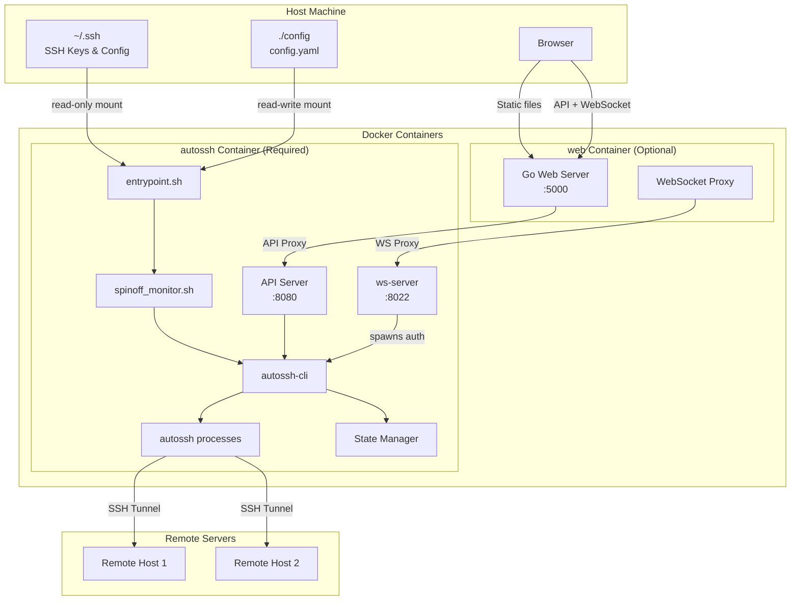
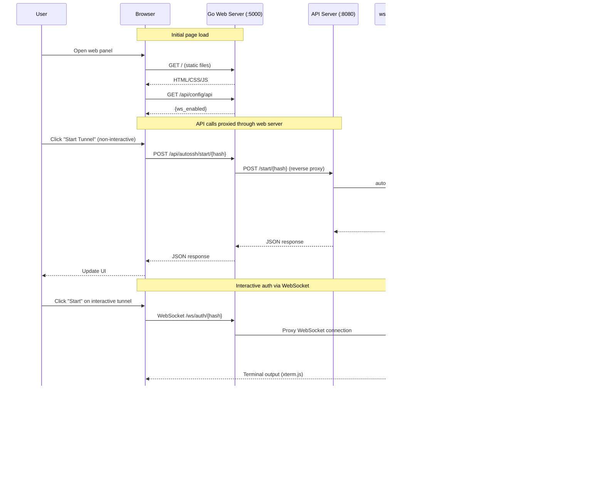
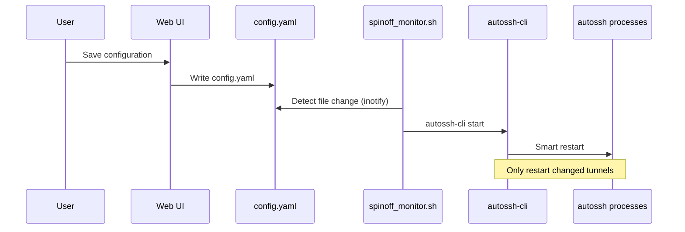

# Architecture

This document describes the architecture of the SSH Tunnel Manager, including the Docker containers and their interactions.

## System Overview

The SSH Tunnel Manager provides two Docker images:

1. **autossh-tunnel** (Required) - The core tunnel management container
2. **autossh-tunnel-web-panel** (Optional) - Web-based management interface

!!! note "Minimal Setup"
    You only need the `autossh-tunnel` container to run SSH tunnels. The web panel is optional and provides a convenient UI for management.


```mermaid
graph TB
    subgraph "Host Machine"
        SSH[~/.ssh<br/>SSH Keys & Config]
        CONFIG[./config<br/>config.yaml]
        BROWSER[Browser]
    end

    subgraph "Docker Containers"
        subgraph "autossh Container (Required)"
            ENTRY[entrypoint.sh]
            MONITOR[spinoff_monitor.sh]
            CLI[autossh-cli]
            API[API Server<br/>:8080]
            WSSERVER[ws-server<br/>:8022]
            AUTOSSH[autossh processes]
            STATE[State Manager]
        end

        subgraph "web Container (Optional)"
            WEBSERVER[Go Web Server<br/>:5000]
            WSPPROXY[WebSocket Proxy]
        end
    end

    subgraph "Remote Servers"
        REMOTE1[Remote Host 1]
        REMOTE2[Remote Host 2]
    end

    SSH -->|read-only mount| ENTRY
    CONFIG -->|read-write mount| ENTRY
    BROWSER -->|Static files| WEBSERVER

    ENTRY --> MONITOR
    MONITOR --> CLI
    CLI --> STATE
    CLI --> AUTOSSH
    API --> CLI
    WSSERVER -->|spawns auth| CLI

    BROWSER -->|API + WebSocket| WEBSERVER
    WEBSERVER -->|API Proxy| API
    WSPPROXY -->|WS Proxy| WSSERVER

    AUTOSSH -->|SSH Tunnel| REMOTE1
    AUTOSSH -->|SSH Tunnel| REMOTE2
```

---

## autossh-tunnel Container

**Image:** `oaklight/autossh-tunnel:latest`

The core container that manages SSH tunnels using autossh.

### Components

| Component | Description |
|-----------|-------------|
| `entrypoint.sh` | Initializes the container, sets up permissions, and starts the main process |
| `spinoff_monitor.sh` | Monitors config file changes and triggers tunnel restarts |
| `autossh-cli` | Command-line interface for tunnel management |
| `API Server` | HTTP API for programmatic control (optional, port 8080) |
| `ws-server` | WebSocket server for in-browser interactive authentication (optional, port 8022) |
| `autossh` | The actual SSH tunnel processes |
| `State Manager` | Tracks running tunnels and their PIDs |

### Volume Mounts

| Host Path | Container Path | Mode | Description |
|-----------|----------------|------|-------------|
| `~/.ssh` | `/home/myuser/.ssh` | `ro` | SSH keys and config (read-only) |
| `./config` | `/etc/autossh/config` | `rw` | Tunnel configuration (read-write for Config API) |

### Environment Variables

| Variable | Description | Default | Required |
|----------|-------------|---------|----------|
| `PUID` | User ID for file permissions | `1000` | No |
| `PGID` | Group ID for file permissions | `1000` | No |
| `API_ENABLE` | Enable HTTP API server | `false` | No |
| `API_PORT` | HTTP API server port (when API enabled) | `8080` | No |
| `WS_PORT` | WebSocket server (ws-server) listen port for interactive auth | `8022` | No |
| `AUTOSSH_GATETIME` | Autossh gate time (seconds before connection considered stable) | `0` | No |
| `AUTOSSH_CONFIG_FILE` | Path to configuration file | `/etc/autossh/config/config.yaml` | No |
| `SSH_CONFIG_DIR` | SSH config directory | `/home/myuser/.ssh` | No |
| `AUTOSSH_STATE_FILE` | Path to state file | `/tmp/autossh_tunnels.state` | No |

### API Endpoints (when API_ENABLE=true)

| Method | Endpoint | Description |
|--------|----------|-------------|
| GET | `/list` | List all configured tunnels |
| GET | `/status` | Get status of all tunnels |
| POST | `/start` | Start all tunnels |
| POST | `/stop` | Stop all tunnels |
| POST | `/start/{hash}` | Start specific tunnel |
| POST | `/stop/{hash}` | Stop specific tunnel |
| GET | `/logs` | List available log files |
| GET | `/logs/{hash}` | Get logs for specific tunnel |
| GET | `/config` | Get all tunnel configurations |
| GET | `/config/{hash}` | Get single tunnel configuration |
| POST | `/config` | Replace all configurations |
| POST | `/config/new` | Add new tunnel |
| POST | `/config/{hash}` | Update single tunnel |
| DELETE | `/config/{hash}` | Delete tunnel |

### Minimal Docker Compose Example

```yaml
name: autotunnel
services:
  autossh:
    image: oaklight/autossh-tunnel:latest
    volumes:
      - ~/.ssh:/home/myuser/.ssh:ro
      - ./config:/etc/autossh/config:rw
    environment:
      - PUID=1000
      - PGID=1000
    network_mode: "host"
    restart: always
```

### With API Enabled

```yaml
name: autotunnel
services:
  autossh:
    image: oaklight/autossh-tunnel:latest
    volumes:
      - ~/.ssh:/home/myuser/.ssh:ro
      - ./config:/etc/autossh/config:rw
    environment:
      - PUID=1000
      - PGID=1000
      - API_ENABLE=true
      - API_PORT=8080
    network_mode: "host"
    restart: always
```

---

## autossh-tunnel-web-panel Container

**Image:** `oaklight/autossh-tunnel-web-panel:latest`

An optional web-based management interface that communicates with the autossh container's API.

!!! warning "Prerequisite"
    The web panel requires the autossh container to have `API_ENABLE=true` set.

### Components

| Component | Description |
|-----------|-------------|
| `Go Web Server` | Serves static files, proxies API and WebSocket connections |
| `API Proxy` | Reverse proxy forwarding `/api/autossh/*` requests to the autossh API backend |
| `WebSocket Proxy` | Proxies browser WebSocket connections to the ws-server for interactive auth |
| `Web UI` | HTML/CSS/JavaScript frontend with i18n and dark/light theme support (runs in browser) |

### Volume Mounts

!!! note "No Config Volume Required"
    Since v2.1.0, the web panel no longer requires a config volume mount. All configuration operations are performed through the Config API on the autossh container.

### Environment Variables

| Variable | Description | Default | Required |
|----------|-------------|---------|----------|
| `TZ` | Timezone for log timestamps | `UTC` | No |
| `PORT` | Web panel listen port | `5000` | No |
| `API_BASE_URL` | URL of the autossh API server (used server-side for proxying, not sent to browser) | `http://localhost:8080` | **Yes** |
| `WS_BASE_URL` | URL of the ws-server for WebSocket proxy (e.g., `ws://localhost:8022`) | (not set) | No |

!!! info "API Proxy Architecture"
    The `API_BASE_URL` is used by the Go web server to proxy API requests to the autossh backend. The browser never contacts the autossh API directly — all requests go through the web panel at `/api/autossh/*`. This ensures the web panel works reliably for remote access.

### Docker Compose Example

```yaml
name: autotunnel
services:
  web:
    image: oaklight/autossh-tunnel-web-panel:latest
    ports:
      - "5000:5000"
    # No config volume needed - web panel uses Config API from autossh container
    environment:
      - TZ=Asia/Shanghai
      # API_BASE_URL is used by the web server to proxy API requests (server-side only)
      - API_BASE_URL=http://localhost:8080
      - WS_BASE_URL=ws://localhost:8022    # Optional: enable in-browser interactive auth
    restart: always
```

!!! note "Network Mode"
    The web container uses bridge networking with port mapping. All API and WebSocket requests from the browser are proxied through the web server to the autossh backend.

---

## Full Stack Deployment

When using both containers together:

```yaml
name: autotunnel
services:
  autossh:
    image: oaklight/autossh-tunnel:latest
    volumes:
      - ~/.ssh:/home/myuser/.ssh:ro
      - ./config:/etc/autossh/config:rw
    environment:
      - PUID=1000
      - PGID=1000
      - AUTOSSH_GATETIME=0
      - API_ENABLE=true
      - API_PORT=8080
      - WS_PORT=8022              # Optional: ws-server for interactive auth
    network_mode: "host"
    restart: always

  web:
    image: oaklight/autossh-tunnel-web-panel:latest
    ports:
      - "5000:5000"
    # No config volume needed - web panel uses Config API from autossh container
    environment:
      - TZ=Asia/Shanghai
      # API_BASE_URL is used by the web server to proxy API requests (server-side only)
      - API_BASE_URL=http://localhost:8080
      - WS_BASE_URL=ws://localhost:8022   # Optional: enable in-browser interactive auth
    restart: always
```

!!! note "Configuration Management"
    The autossh container mounts the config directory as read-write (`rw`) to support the Config API. The web panel no longer needs direct access to config files - all configuration operations go through the API.

!!! info "Network Architecture"
    - The **autossh container** uses host network mode to allow tunnels to bind to specific IP addresses
    - The **web container** uses bridge networking with port mapping (5000:5000)
    - The browser only connects to the web panel (port 5000) — all API and WebSocket requests are **proxied** through the Go web server to the autossh backend
    - `API_BASE_URL` and `WS_BASE_URL` are server-side URLs used for proxying, not accessed by the browser

---

## Communication Flow

### Web Panel to Tunnel Control (Proxy Architecture)

The web panel uses a **proxy architecture** where all browser requests go through the Go web server, which proxies them to the autossh backend. This ensures reliable operation even when the Docker host is accessed remotely.


```mermaid
sequenceDiagram
    participant User
    participant Browser as Browser
    participant WebServer as Go Web Server (:5000)
    participant API as API Server (:8080)
    participant WSSERVER as ws-server (:8022)
    participant CLI as autossh-cli
    participant Tunnel as autossh process

    Note over Browser,WebServer: Initial page load
    User->>Browser: Open web panel
    Browser->>WebServer: GET / (static files)
    WebServer-->>Browser: HTML/CSS/JS
    Browser->>WebServer: GET /api/config/api
    WebServer-->>Browser: {ws_enabled}

    Note over Browser,API: API calls proxied through web server
    User->>Browser: Click "Start Tunnel" (non-interactive)
    Browser->>WebServer: POST /api/autossh/start/{hash}
    WebServer->>API: POST /start/{hash} (reverse proxy)
    API->>CLI: autossh-cli start-tunnel {hash}
    CLI->>Tunnel: Start autossh process
    Tunnel-->>CLI: PID
    CLI-->>API: Success + output
    API-->>WebServer: JSON response
    WebServer-->>Browser: JSON response
    Browser-->>User: Update UI

    Note over Browser,WSSERVER: Interactive auth via WebSocket
    User->>Browser: Click "Start" on interactive tunnel
    Browser->>WebServer: WebSocket /ws/auth/{hash}
    WebServer->>WSSERVER: Proxy WebSocket connection
    WSSERVER->>CLI: Spawn autossh-cli auth {hash}
    CLI-->>WSSERVER: Password prompt
    WSSERVER-->>Browser: Terminal output (xterm.js)
    User->>Browser: Enter password/2FA
    Browser->>WSSERVER: User input
    WSSERVER->>CLI: Forward input
    CLI-->>WSSERVER: Auth success
    WSSERVER-->>Browser: Success status
    Browser-->>User: Auto-close modal, refresh status
```

!!! tip "Benefits of Proxy Architecture"
    - **Remote access**: Works from any browser, even when the Docker host is on a remote machine
    - **Single entry point**: Only port 5000 needs to be accessible from the browser
    - **Simplified networking**: Web container doesn't need host network mode
    - **In-browser auth**: WebSocket proxy enables interactive authentication without CLI access

### Configuration Change Detection


```mermaid
sequenceDiagram
    participant User
    participant WebUI as Web UI
    participant Config as config.yaml
    participant Monitor as spinoff_monitor.sh
    participant CLI as autossh-cli
    participant Tunnels as autossh processes

    User->>WebUI: Save configuration
    WebUI->>Config: Write config.yaml
    Monitor->>Config: Detect file change (inotify)
    Monitor->>CLI: autossh-cli start
    CLI->>Tunnels: Smart restart
    Note over CLI,Tunnels: Only restart changed tunnels
```

---

## Network Mode

The containers use different network modes based on their requirements:

### autossh Container (Host Network)

The autossh container uses `network_mode: "host"` to:

1. Allow direct access to host network interfaces
2. Enable tunnels to bind to specific IP addresses
3. Simplify port forwarding configuration

### web Container (Bridge Network)

The web container uses bridge networking with port mapping:

```yaml
ports:
  - "5000:5000"
```

This is possible because:

1. The web server proxies all API and WebSocket requests to the autossh backend
2. The browser only needs to reach the web panel (port 5000)
3. `API_BASE_URL` and `WS_BASE_URL` are server-side URLs for the proxy, not browser-facing

!!! note "Remote Access"
    Since all requests are proxied through the web panel, the browser only needs to reach port 5000. The autossh API port (8080) does not need to be accessible from the browser — it only needs to be reachable by the web panel container.

---

## File Structure

```
/home/myuser/                    # In containers
├── .ssh/                        # SSH keys and config (from host)
│   ├── config                   # SSH host configurations
│   ├── id_ed25519              # Private key
│   └── known_hosts             # Known hosts
└── config/                      # Tunnel configuration (web container)
    └── config.yaml             # Tunnel definitions

/etc/autossh/config/             # In autossh container
└── config.yaml                  # Tunnel definitions

/tmp/                            # Runtime files
├── autossh_tunnels.state       # Tunnel state tracking
└── autossh-logs/               # Tunnel log files
    └── tunnel-{hash}.log       # Per-tunnel logs
```

---

## Security Considerations

1. **SSH Keys**: Mounted read-only to prevent modification
2. **Non-root User**: Containers run as `myuser` (configurable via PUID/PGID)
3. **State Isolation**: Each tunnel has isolated state and logs
4. **API Access**: API server only accessible on localhost by default (host network mode)