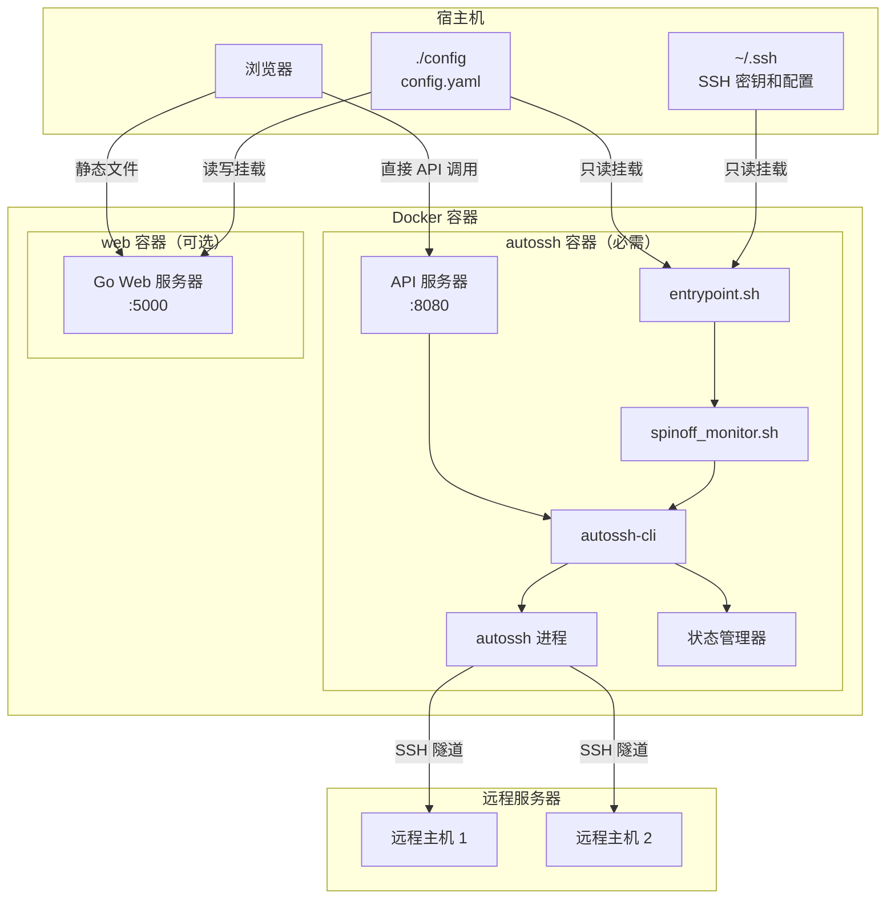
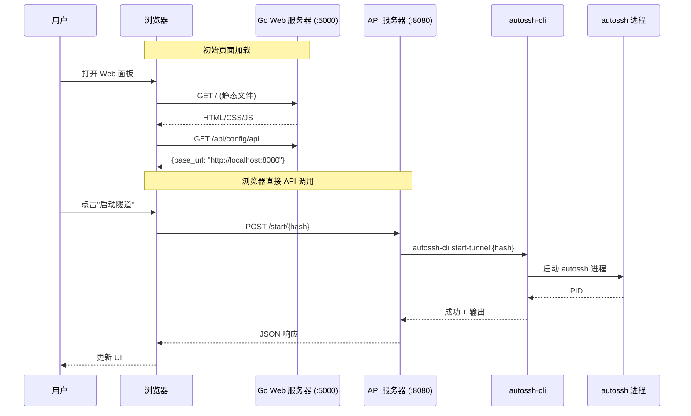

# 架构说明

本文档描述了 SSH 隧道管理器的架构，包括 Docker 容器及其交互方式。

## 系统概述

SSH 隧道管理器提供两个 Docker 镜像：

1. **autossh-tunnel**（必需）- 核心隧道管理容器
2. **autossh-tunnel-web-panel**（可选）- 基于 Web 的管理界面

!!! note "最小化设置"
    您只需要 `autossh-tunnel` 容器即可运行 SSH 隧道。Web 面板是可选的，提供便捷的 UI 管理界面。



---

## autossh-tunnel 容器

**镜像：** `oaklight/autossh-tunnel:latest`

使用 autossh 管理 SSH 隧道的核心容器。

### 组件

| 组件 | 描述 |
|------|------|
| `entrypoint.sh` | 初始化容器，设置权限，启动主进程 |
| `spinoff_monitor.sh` | 监控配置文件变化并触发隧道重启 |
| `autossh-cli` | 隧道管理的命令行界面 |
| `API Server` | 用于程序化控制的 HTTP API（可选，端口 8080） |
| `autossh` | 实际的 SSH 隧道进程 |
| `State Manager` | 跟踪运行中的隧道及其 PID |

### 卷挂载

| 宿主机路径 | 容器路径 | 模式 | 描述 |
|-----------|---------|------|------|
| `~/.ssh` | `/home/myuser/.ssh` | `ro` | SSH 密钥和配置（只读） |
| `./config` | `/etc/autossh/config` | `ro` | 隧道配置（只读） |

### 环境变量

| 变量 | 描述 | 默认值 | 必需 |
|------|------|--------|------|
| `PUID` | 文件权限的用户 ID | `1000` | 否 |
| `PGID` | 文件权限的组 ID | `1000` | 否 |
| `API_ENABLE` | 启用 HTTP API 服务器 | `false` | 否 |
| `API_PORT` | HTTP API 服务器端口（启用 API 时） | `8080` | 否 |
| `AUTOSSH_GATETIME` | Autossh 网关时间（连接被视为稳定前的秒数） | `0` | 否 |
| `AUTOSSH_CONFIG_FILE` | 配置文件路径 | `/etc/autossh/config/config.yaml` | 否 |
| `SSH_CONFIG_DIR` | SSH 配置目录 | `/home/myuser/.ssh` | 否 |
| `AUTOSSH_STATE_FILE` | 状态文件路径 | `/tmp/autossh_tunnels.state` | 否 |

### API 端点（当 API_ENABLE=true 时）

| 方法 | 端点 | 描述 |
|------|------|------|
| GET | `/list` | 列出所有配置的隧道 |
| GET | `/status` | 获取所有隧道的状态 |
| POST | `/start` | 启动所有隧道 |
| POST | `/stop` | 停止所有隧道 |
| POST | `/start/{hash}` | 启动特定隧道 |
| POST | `/stop/{hash}` | 停止特定隧道 |
| GET | `/logs` | 列出可用的日志文件 |
| GET | `/logs/{hash}` | 获取特定隧道的日志 |

### 最小 Docker Compose 示例

```yaml
name: autotunnel
services:
  autossh:
    image: oaklight/autossh-tunnel:latest
    volumes:
      - ~/.ssh:/home/myuser/.ssh:ro
      - ./config:/etc/autossh/config:ro
    environment:
      - PUID=1000
      - PGID=1000
    network_mode: "host"
    restart: always
```

### 启用 API

```yaml
name: autotunnel
services:
  autossh:
    image: oaklight/autossh-tunnel:latest
    volumes:
      - ~/.ssh:/home/myuser/.ssh:ro
      - ./config:/etc/autossh/config:ro
    environment:
      - PUID=1000
      - PGID=1000
      - API_ENABLE=true
      - API_PORT=8080
    network_mode: "host"
    restart: always
```

---

## autossh-tunnel-web-panel 容器

**镜像：** `oaklight/autossh-tunnel-web-panel:latest`

可选的基于 Web 的管理界面，与 autossh 容器的 API 通信。

!!! warning "前置条件"
    Web 面板需要 autossh 容器设置 `API_ENABLE=true`。

### 组件

| 组件 | 描述 |
|------|------|
| `Go Web Server` | 提供静态文件并管理配置 |
| `Web UI` | 支持国际化的 HTML/CSS/JavaScript 前端（在浏览器中运行） |

### 卷挂载

| 宿主机路径 | 容器路径 | 模式 | 描述 |
|-----------|---------|------|------|
| `./config` | `/home/myuser/config` | `rw` | 隧道配置（用于编辑） |

### 环境变量

| 变量 | 描述 | 默认值 | 必需 |
|------|------|--------|------|
| `PUID` | 文件权限的用户 ID | `1000` | 否 |
| `PGID` | 文件权限的组 ID | `1000` | 否 |
| `TZ` | 日志时间戳的时区 | `UTC` | 否 |
| `API_BASE_URL` | autossh API 服务器的 URL（传递给浏览器） | `http://localhost:8080` | **是** |

!!! info "直接 API 架构"
    `API_BASE_URL` 会传递给基于浏览器的前端，前端直接向 autossh 容器发起 API 调用。Go Web 服务器不代理 API 请求 - 它只提供静态文件和配置管理。

### Docker Compose 示例

```yaml
name: autotunnel
services:
  web:
    image: oaklight/autossh-tunnel-web-panel:latest
    ports:
      - "5000:5000"
    volumes:
      - ./config:/home/myuser/config
    environment:
      - PUID=1000
      - PGID=1000
      - TZ=Asia/Shanghai
      - API_BASE_URL=http://localhost:8080
    restart: always
```

!!! note "网络模式"
    Web 容器使用 bridge 网络和端口映射，而不是 host 网络模式。API 调用直接从浏览器发送到 API 服务器。

---

## 完整部署

同时使用两个容器时：

```yaml
name: autotunnel
services:
  autossh:
    image: oaklight/autossh-tunnel:latest
    volumes:
      - ~/.ssh:/home/myuser/.ssh:ro
      - ./config:/etc/autossh/config:ro
    environment:
      - PUID=1000
      - PGID=1000
      - AUTOSSH_GATETIME=0
      - API_ENABLE=true
      - API_PORT=8080
    network_mode: "host"
    restart: always

  web:
    image: oaklight/autossh-tunnel-web-panel:latest
    ports:
      - "5000:5000"
    volumes:
      - ./config:/home/myuser/config:rw
    environment:
      - PUID=1000
      - PGID=1000
      - TZ=Asia/Shanghai
      - API_BASE_URL=http://localhost:8080
    restart: always
```

!!! note "配置编辑"
    Web 面板将配置目录挂载为读写模式（`rw`）以允许通过 UI 编辑配置。autossh 容器只需要读取权限（`ro`），因为它只读取配置。

!!! info "网络架构"
    - **autossh 容器** 使用 host 网络模式以允许隧道绑定到特定 IP 地址
    - **web 容器** 使用 bridge 网络和端口映射（5000:5000）
    - 浏览器 **直接调用 API** 到 autossh API 服务器（端口 8080）
    - Go Web 服务器只提供静态文件和配置管理端点

---

## 通信流程

### Web 面板到隧道控制（直接 API 架构）

Web 面板使用 **直接 API 架构**，浏览器直接向 autossh API 服务器发起 API 调用，绕过 Go Web 服务器进行隧道控制操作。



!!! tip "直接 API 架构的优势"
    - **简化网络配置**：Web 容器不需要 host 网络模式
    - **降低延迟**：API 调用无代理开销
    - **更好的可扩展性**：Web 服务器只处理静态文件
    - **更清晰的分离**：配置管理与隧道控制分离

### 配置变更检测


---

## 网络模式

容器根据其需求使用不同的网络模式：

### autossh 容器（Host 网络）

autossh 容器使用 `network_mode: "host"` 以：

1. 允许直接访问宿主机网络接口
2. 使隧道能够绑定到特定 IP 地址
3. 简化端口转发配置

### web 容器（Bridge 网络）

Web 容器使用 bridge 网络和端口映射：

```yaml
ports:
  - "5000:5000"
```

这是可行的，因为：

1. Web 服务器只提供静态文件和配置端点
2. 所有 API 调用都直接从浏览器发送到 API 服务器
3. Web 和 autossh 容器之间不需要代理功能

!!! note "API 可访问性"
    由于浏览器直接向端口 8080 发起 API 调用，API 服务器必须从用户的浏览器可访问。当 autossh 使用 host 网络模式时，API 在宿主机的 `localhost:8080` 上可用。

---

## 文件结构

```
/home/myuser/                    # 容器内
├── .ssh/                        # SSH 密钥和配置（来自宿主机）
│   ├── config                   # SSH 主机配置
│   ├── id_ed25519              # 私钥
│   └── known_hosts             # 已知主机
└── config/                      # 隧道配置（web 容器）
    └── config.yaml             # 隧道定义

/etc/autossh/config/             # autossh 容器内
└── config.yaml                  # 隧道定义

/tmp/                            # 运行时文件
├── autossh_tunnels.state       # 隧道状态跟踪
└── autossh-logs/               # 隧道日志文件
    └── tunnel-{hash}.log       # 每个隧道的日志
```

---

## 安全考虑

1. **SSH 密钥**：以只读方式挂载以防止修改
2. **非 root 用户**：容器以 `myuser` 运行（可通过 PUID/PGID 配置）
3. **状态隔离**：每个隧道都有独立的状态和日志
4. **API 访问**：API 服务器默认仅在 localhost 上可访问（宿主机网络模式）