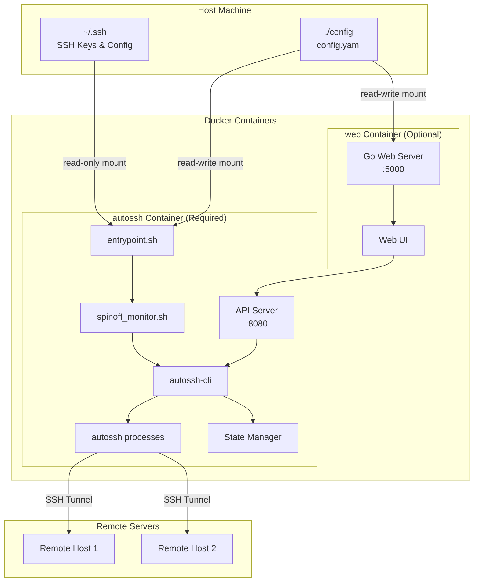
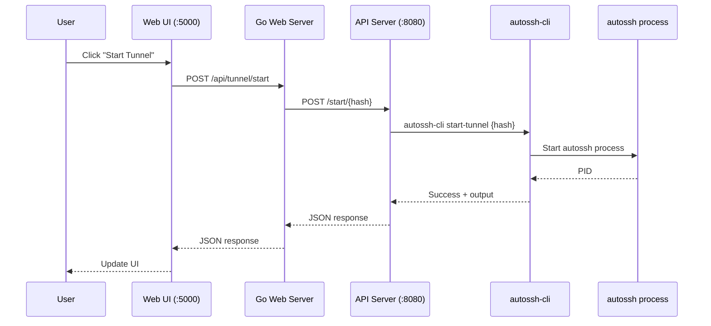

# Architecture

This document describes the architecture of the SSH Tunnel Manager, including the Docker containers and their interactions.

## System Overview

The SSH Tunnel Manager provides two Docker images:

1. **autossh-tunnel** (Required) - The core tunnel management container
2. **autossh-tunnel-web-panel** (Optional) - Web-based management interface

!!! note "Minimal Setup"
    You only need the `autossh-tunnel` container to run SSH tunnels. The web panel is optional and provides a convenient UI for management.



---

## autossh-tunnel Container

**Image:** `oaklight/autossh-tunnel:latest`

The core container that manages SSH tunnels using autossh.

### Components

| Component | Description |
|-----------|-------------|
| `entrypoint.sh` | Initializes the container, sets up permissions, and starts the main process |
| `spinoff_monitor.sh` | Monitors config file changes and triggers tunnel restarts |
| `autossh-cli` | Command-line interface for tunnel management |
| `API Server` | HTTP API for programmatic control (optional, port 8080) |
| `autossh` | The actual SSH tunnel processes |
| `State Manager` | Tracks running tunnels and their PIDs |

### Volume Mounts

| Host Path | Container Path | Mode | Description |
|-----------|----------------|------|-------------|
| `~/.ssh` | `/home/myuser/.ssh` | `ro` | SSH keys and config (read-only) |
| `./config` | `/etc/autossh/config` | `ro` | Tunnel configuration (read-only) |

### Environment Variables

| Variable | Description | Default | Required |
|----------|-------------|---------|----------|
| `PUID` | User ID for file permissions | `1000` | No |
| `PGID` | Group ID for file permissions | `1000` | No |
| `API_ENABLE` | Enable HTTP API server | `false` | No |
| `API_PORT` | HTTP API server port (when API enabled) | `8080` | No |
| `AUTOSSH_GATETIME` | Autossh gate time (seconds before connection considered stable) | `0` | No |
| `AUTOSSH_CONFIG_FILE` | Path to configuration file | `/etc/autossh/config/config.yaml` | No |
| `SSH_CONFIG_DIR` | SSH config directory | `/home/myuser/.ssh` | No |
| `AUTOSSH_STATE_FILE` | Path to state file | `/tmp/autossh_tunnels.state` | No |

### API Endpoints (when API_ENABLE=true)

| Method | Endpoint | Description |
|--------|----------|-------------|
| GET | `/list` | List all configured tunnels |
| GET | `/status` | Get status of all tunnels |
| POST | `/start` | Start all tunnels |
| POST | `/stop` | Stop all tunnels |
| POST | `/start/{hash}` | Start specific tunnel |
| POST | `/stop/{hash}` | Stop specific tunnel |
| GET | `/logs` | List available log files |
| GET | `/logs/{hash}` | Get logs for specific tunnel |

### Minimal Docker Compose Example

```yaml
name: autotunnel
services:
  autossh:
    image: oaklight/autossh-tunnel:latest
    volumes:
      - ~/.ssh:/home/myuser/.ssh:ro
      - ./config:/etc/autossh/config:ro
    environment:
      - PUID=1000
      - PGID=1000
    network_mode: "host"
    restart: always
```

### With API Enabled

```yaml
name: autotunnel
services:
  autossh:
    image: oaklight/autossh-tunnel:latest
    volumes:
      - ~/.ssh:/home/myuser/.ssh:ro
      - ./config:/etc/autossh/config:ro
    environment:
      - PUID=1000
      - PGID=1000
      - API_ENABLE=true
      - API_PORT=8080
    network_mode: "host"
    restart: always
```

---

## autossh-tunnel-web-panel Container

**Image:** `oaklight/autossh-tunnel-web-panel:latest`

An optional web-based management interface that communicates with the autossh container's API.

!!! warning "Prerequisite"
    The web panel requires the autossh container to have `API_ENABLE=true` set.

### Components

| Component | Description |
|-----------|-------------|
| `Go Web Server` | Serves the web UI and proxies API requests |
| `Web UI` | HTML/CSS/JavaScript frontend with i18n support |

### Volume Mounts

| Host Path | Container Path | Mode | Description |
|-----------|----------------|------|-------------|
| `./config` | `/home/myuser/config` | `rw` | Tunnel configuration (for editing) |

### Environment Variables

| Variable | Description | Default | Required |
|----------|-------------|---------|----------|
| `PUID` | User ID for file permissions | `1000` | No |
| `PGID` | Group ID for file permissions | `1000` | No |
| `TZ` | Timezone for log timestamps | `UTC` | No |
| `API_BASE_URL` | URL of the autossh API server | `http://localhost:8080` | **Yes** |

### Docker Compose Example

```yaml
name: autotunnel
services:
  web:
    image: oaklight/autossh-tunnel-web-panel:latest
    network_mode: "host"
    volumes:
      - ./config:/home/myuser/config
    environment:
      - PUID=1000
      - PGID=1000
      - TZ=Asia/Shanghai
      - API_BASE_URL=http://localhost:8080
    restart: always
```

---

## Full Stack Deployment

When using both containers together:

```yaml
name: autotunnel
services:
  autossh:
    image: oaklight/autossh-tunnel:latest
    volumes:
      - ~/.ssh:/home/myuser/.ssh:ro
      - ./config:/etc/autossh/config:ro
    environment:
      - PUID=1000
      - PGID=1000
      - AUTOSSH_GATETIME=0
      - API_ENABLE=true
      - API_PORT=8080
    network_mode: "host"
    restart: always

  web:
    image: oaklight/autossh-tunnel-web-panel:latest
    network_mode: "host"
    volumes:
      - ./config:/home/myuser/config:rw
    environment:
      - PUID=1000
      - PGID=1000
      - TZ=Asia/Shanghai
      - API_BASE_URL=http://localhost:8080
    restart: always
```

!!! note "Configuration Editing"
    The web panel mounts the config directory as read-write (`rw`) to allow editing the configuration through the UI. The autossh container only needs read access (`ro`) since it only reads the configuration.

---

## Communication Flow

### Web Panel to Tunnel Control



### Configuration Change Detection


---

## Network Mode

Both containers use `network_mode: "host"` to:

1. Allow direct access to host network interfaces
2. Enable tunnels to bind to specific IP addresses
3. Simplify port forwarding configuration

---

## File Structure

```
/home/myuser/                    # In containers
├── .ssh/                        # SSH keys and config (from host)
│   ├── config                   # SSH host configurations
│   ├── id_ed25519              # Private key
│   └── known_hosts             # Known hosts
└── config/                      # Tunnel configuration (web container)
    └── config.yaml             # Tunnel definitions

/etc/autossh/config/             # In autossh container
└── config.yaml                  # Tunnel definitions

/tmp/                            # Runtime files
├── autossh_tunnels.state       # Tunnel state tracking
└── autossh-logs/               # Tunnel log files
    └── tunnel-{hash}.log       # Per-tunnel logs
```

---

## Security Considerations

1. **SSH Keys**: Mounted read-only to prevent modification
2. **Non-root User**: Containers run as `myuser` (configurable via PUID/PGID)
3. **State Isolation**: Each tunnel has isolated state and logs
4. **API Access**: API server only accessible on localhost by default (host network mode)