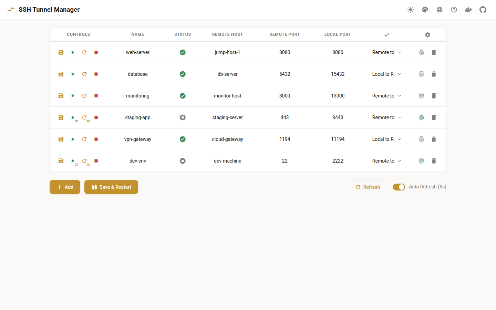

# Web 面板使用指南

Web 面板提供了一个可视化界面来管理 SSH 隧道配置，无需手动编辑 YAML 文件。



## 功能特性

- **可视化配置编辑**：通过友好的界面查看和编辑 `config.yaml` 文件
- **自动备份**：每次保存更改时自动备份配置到 `config/backups/` 目录
- **实时更新**：配置更改后自动重载隧道，无需重启容器
- **多语言支持**：支持中文、英文等多种语言
- **隧道状态监控**：实时查看每个隧道的运行状态
- **单个隧道控制**：独立启动、停止每个隧道

## 访问 Web 面板

启动服务后，在浏览器中访问：

```
http://localhost:5000
```

如果您修改了 Web 面板的端口，请使用相应的端口号。

## 界面说明

### 主页面

主页面显示所有配置的隧道列表，包括：

- **隧道名称**：自定义的隧道标识
- **远程主机**：SSH 连接的目标主机
- **端口映射**：本地端口和远程端口的映射关系
- **方向**：隧道方向（本地到远程 / 远程到本地）
- **状态**：运行中 / 已停止
- **操作按钮**：启动、停止、编辑、删除

### 添加隧道

1. 点击"添加隧道"按钮
2. 填写隧道配置：
   - **名称**：隧道的自定义名称（可选）
   - **远程主机**：SSH 主机配置名称（如 `user@remote-host`）
   - **远程端口**：远程服务器上的端口
   - **本地端口**：本地机器上的端口
   - **方向**：选择 `local_to_remote` 或 `remote_to_local`
   - **交互模式**：是否需要交互式 SSH 会话（通常选择 false）
3. 点击"保存"

### 编辑隧道

1. 在隧道列表中找到要编辑的隧道
2. 点击"编辑"按钮
3. 修改配置
4. 点击"保存"

### 删除隧道

1. 在隧道列表中找到要删除的隧道
2. 点击"删除"按钮
3. 确认删除操作

### 启动/停止隧道

- **启动单个隧道**：点击隧道旁的"启动"按钮
- **停止单个隧道**：点击隧道旁的"停止"按钮
- **启动所有隧道**：点击页面顶部的"启动所有"按钮
- **停止所有隧道**：点击页面顶部的"停止所有"按钮

## 配置备份

Web 面板每次保存更改时会自动创建配置备份：

- **备份位置**：`config/backups/`
- **备份格式**：`config.yaml.backup.YYYYMMDD_HHMMSS`
- **备份管理**：需要手动清理旧备份以防止磁盘空间问题

### 恢复备份

如果需要恢复之前的配置：

```bash
# 查看可用备份
ls -la config/backups/

# 恢复特定备份
cp config/backups/config.yaml.backup.20240115_143022 config/config.yaml

# 重启服务以应用恢复的配置
docker compose restart autossh
```

## 高级配置

### 指定绑定地址

在 Web 面板中，您可以使用 `ip:port` 格式来指定绑定地址：

**远程端口绑定到特定 IP：**
```
远程端口: 192.168.45.130:22323
```

**本地端口绑定到特定 IP：**
```
本地端口: 192.168.1.100:18120
```

### 使用 SSH 配置别名

在"远程主机"字段中，您可以使用 `~/.ssh/config` 中定义的主机别名：

```
远程主机: myserver
```

这将使用 SSH 配置文件中 `myserver` 的配置。

## 故障排除

### Web 面板无法访问

1. 检查容器是否运行：
   ```bash
   docker compose ps
   ```

2. 检查端口是否被占用：
   ```bash
   netstat -tuln | grep 5000
   ```

3. 查看 Web 面板日志：
   ```bash
   docker compose logs web
   ```

### 配置保存后隧道未更新

1. 检查 autossh 容器日志：
   ```bash
   docker compose logs autossh
   ```

2. 验证配置文件格式：
   ```bash
   cat config/config.yaml
   ```

3. 手动重启 autossh 服务：
   ```bash
   docker compose restart autossh
   ```

### 备份目录占用过多空间

定期清理旧备份：

```bash
# 删除 7 天前的备份
find config/backups/ -name "*.backup.*" -mtime +7 -delete

# 或只保留最近 10 个备份
cd config/backups/
ls -t | tail -n +11 | xargs rm -f
```

## 安全建议

1. **限制访问**：默认情况下，Web 面板只监听 localhost。如果需要远程访问，请使用 SSH 隧道或 VPN。

2. **使用防火墙**：确保 Web 面板端口（默认 5000）不对公网开放。

3. **定期备份**：虽然 Web 面板会自动备份，但建议定期手动备份重要配置。

4. **审查更改**：在保存配置前仔细检查，避免意外中断现有隧道。

## 下一步

- 了解 [CLI 命令](api/cli-reference.md) 进行命令行管理
- 查看 [HTTP API](api/http-api.md) 进行程序化控制
- 阅读 [架构说明](architecture.md) 了解系统工作原理