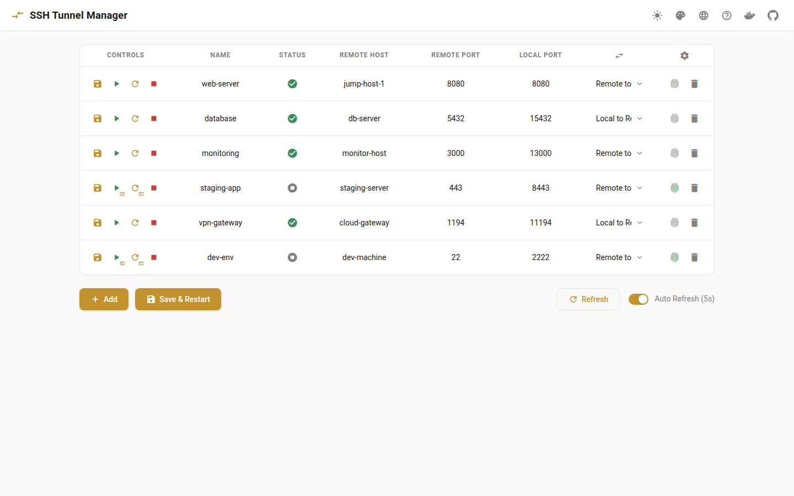
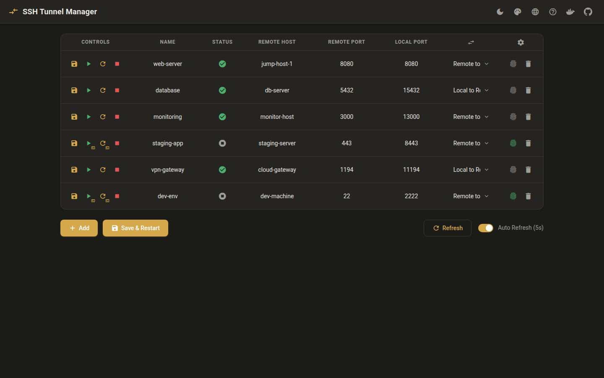
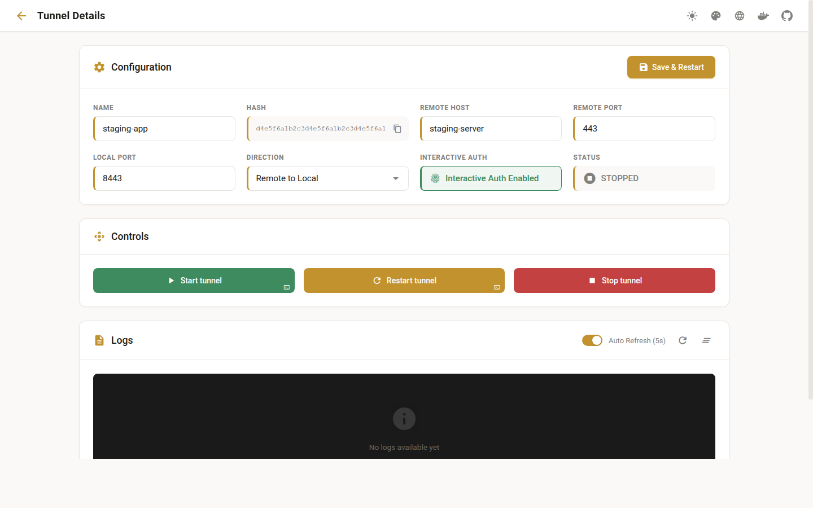
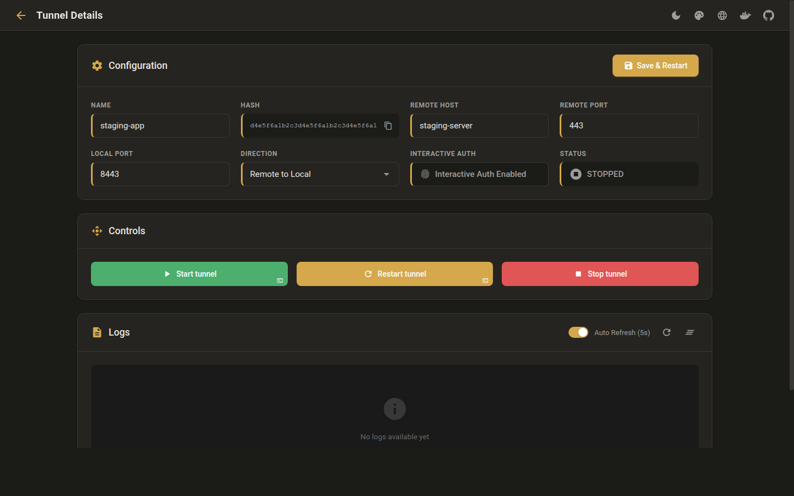

# Web Panel User Guide

The web panel provides a visual interface for managing SSH tunnel configurations without manually editing YAML files.





## Features

- **Visual Configuration Editing**: View and edit tunnel configurations through a user-friendly interface
- **Automatic Backup**: Configuration changes are automatically backed up to `config/backups/` on the autossh container
- **Real-time Updates**: Configuration changes automatically reload tunnels without container restart
- **Multi-language Support**: Supports Chinese, English, and other languages
- **Tunnel Status Monitoring**: Real-time view of each tunnel's running status
- **Individual Tunnel Control**: Start and stop each tunnel independently
- **In-Browser Interactive Authentication**: Start interactive (password/2FA) tunnels directly from the web panel using an embedded xterm.js terminal
- **Dark/Light Theme**: Switch between dark and light color schemes using the theme picker
- **API Proxy Architecture**: All API calls are proxied through the web panel server to the autossh backend, enabling reliable remote access
- **No Config Volume Required**: Web panel no longer needs access to config files - all operations go through the API

## Accessing the Web Panel

After starting the services, access in your browser:

```
http://localhost:5000
```

The default listen port is `5000`. You can change it by setting the `PORT` environment variable on the web container:

```yaml
services:
  web:
    environment:
      - PORT=8888
    ports:
      - "8888:8888"
```

## Interface Overview

### Main Page

The main page displays a list of all configured tunnels in an editable table format:

| Column | Description |
|--------|-------------|
| **Controls** | Per-row action buttons: Save & Restart, Start, Restart, Stop |
| **Name** | Editable tunnel name field |
| **Status** | Status indicator icon (click to open tunnel detail page) |
| **Remote Host** | Editable remote host field |
| **Remote Port** | Editable remote port field |
| **Local Port** | Editable local port field |
| **Direction** | Dropdown to select tunnel direction |
| **Actions** | Interactive Auth toggle and Delete button |

**Status Indicators:**

- 🟢 Green check: Running
- 🔴 Red X: Dead/Error
- 🟠 Orange hourglass: Starting/Loading
- ⚪ Grey stop: Stopped

### Adding a Tunnel

1. Click the "Add" button at the bottom of the page
2. A new empty row will appear in the table
3. Fill in the tunnel configuration directly in the table:
   - **Name**: Custom name for the tunnel
   - **Remote Host**: SSH host configuration name (e.g., `user@remote-host`)
   - **Remote Port**: Port on the remote server (supports `port` or `hostname:port` format)
   - **Local Port**: Port on the local machine (supports `port` or `ip:port` format)
   - **Direction**: Choose `Remote to Local` or `Local to Remote`
4. Click the row's "Save" button (💾) or the global "Save & Restart" button

### Editing Tunnels

Tunnels can be edited directly in the table:

1. Find the tunnel to edit in the tunnel list
2. Modify the configuration fields directly in the table row
3. Click the row's "Save" button (💾) to save and restart only that tunnel
4. Or click the global "Save & Restart" button to save all changes and restart all tunnels

!!! tip "Per-Row Save"
    The per-row save button (💾) allows you to save and restart individual tunnels without affecting other tunnels. This is useful when you only need to modify one tunnel.

### Deleting Tunnels

1. Find the tunnel to delete in the tunnel list
2. Click the "Delete" button
3. Confirm the deletion

### Starting/Stopping Tunnels

Each tunnel row has control buttons:

- **Start** (▶️): Start the tunnel
- **Restart** (🔄): Stop and restart the tunnel
- **Stop** (⏹️): Stop the tunnel

!!! note "Interactive Authentication"
    Click the fingerprint icon (🫆) to toggle interactive authentication mode. When enabled (green), the tunnel requires manual authentication (password or 2FA/TOTP).

    **In-Browser Terminal (WebSocket mode):** When the web panel is configured with `WS_BASE_URL` (see [WebSocket Configuration](#websocket-configuration-for-interactive-auth) below), interactive tunnels display a terminal icon badge on the Start and Restart buttons. Clicking these buttons opens an **xterm.js terminal modal** directly in your browser, allowing you to enter your password or 2FA code without leaving the web interface. On successful authentication, the modal auto-closes and the tunnel status refreshes automatically.

    **CLI Fallback:** If `WS_BASE_URL` is not configured, interactive tunnels cannot be started from the web interface. You must use the CLI command instead:

    ```bash
    docker compose exec -it -u myuser autossh autossh-cli auth <hash>
    ```

    See [CLI Reference - Interactive Authentication](api/cli-reference.md#interactive-authentication) for details.

### Tunnel Detail Page

Click on the status indicator icon in any row to open the tunnel's detail page. The detail page provides:

- **Full Configuration View**: See all tunnel settings
- **Real-time Logs**: View tunnel logs with auto-refresh
- **Control Buttons**: Start, Restart, Stop the tunnel
- **Interactive Auth Badge**: Interactive tunnels show a terminal icon on Start/Restart buttons when WebSocket is configured
- **Configuration Editing**: Modify tunnel settings directly
- **Auto-refresh**: Status and logs update automatically every 5 seconds





## WebSocket Configuration for Interactive Auth

The web panel supports in-browser interactive authentication via a WebSocket server (ws-server) that runs inside the autossh container. When configured, users can authenticate interactive tunnels (password, 2FA/TOTP) directly from the browser using an embedded xterm.js terminal, without needing CLI access.

### How It Works

1. The autossh container runs a **ws-server** that listens for WebSocket connections (default port: `8022`).
2. The web panel proxies WebSocket connections from the browser to the ws-server via the Go web server.
3. When a user clicks Start or Restart on an interactive tunnel, an **xterm.js terminal modal** opens in the browser.
4. The terminal connects over WebSocket to the ws-server, which spawns an `autossh-cli auth <hash>` session.
5. The user enters their password and/or 2FA code in the terminal.
6. On successful authentication, the modal auto-closes and the tunnel status refreshes.

### Environment Variables

| Variable | Container | Description | Default |
|----------|-----------|-------------|---------|
| `WS_PORT` | autossh | Port the ws-server listens on inside the autossh container | `8022` |
| `WS_BASE_URL` | web | URL of the ws-server, used by the web panel to proxy WebSocket connections (e.g., `ws://autossh:8022`) | (not set) |

### Docker Compose Configuration

To enable in-browser interactive authentication, add the following to your `compose.yaml`:

```yaml
services:
  autossh:
    image: oaklight/autossh-tunnel:latest
    volumes:
      - ~/.ssh:/home/myuser/.ssh:ro
      - ./config:/etc/autossh/config:rw
    environment:
      - PUID=1000
      - PGID=1000
      - API_ENABLE=true
      - API_PORT=8080
      - WS_PORT=8022          # ws-server listen port (default: 8022)
    network_mode: "host"
    restart: always

  web:
    image: oaklight/autossh-tunnel-web-panel:latest
    ports:
      - "5000:5000"
    environment:
      # API_BASE_URL is used by the web server to proxy API requests to the autossh backend
      # This is a server-side URL, not accessed by the browser directly
      - API_BASE_URL=http://localhost:8080
      - WS_BASE_URL=ws://localhost:8022   # Enable WebSocket proxy to ws-server
    restart: always
```

!!! tip "When is WS_BASE_URL needed?"
    You only need to set `WS_BASE_URL` if you have tunnels that use `interactive: true` and you want to authenticate them from the browser. If all your tunnels use SSH key-based authentication, you can omit this variable.

### Using the Terminal Modal

When `WS_BASE_URL` is configured and a tunnel has `interactive: true`:

1. The **Start** and **Restart** buttons on that tunnel's row (and on the tunnel detail page) display a small terminal icon badge.
2. Clicking the button opens an xterm.js terminal modal overlay.
3. The terminal displays the SSH authentication prompts (password, verification code, etc.).
4. Enter your credentials in the terminal.
5. On success, the modal closes automatically and the tunnel status updates to RUNNING.
6. If authentication fails, the terminal shows the error and you can close the modal manually.

!!! warning "Network Accessibility"
    The `WS_BASE_URL` is used by the **web panel container** (not the browser) to connect to the ws-server. When the autossh container uses `network_mode: "host"`, use `ws://localhost:8022`. If using Docker bridge networking, use the service name (e.g., `ws://autossh:8022`).

## Theme Support

The web panel supports **dark and light themes**. Use the color scheme picker in the top navigation bar to switch between themes. Your preference is saved in the browser and persists across sessions.

## Configuration Backup

The web panel automatically creates configuration backups every time you save changes:

- **Backup Location**: `config/backups/`
- **Backup Format**: `config.yaml.backup.YYYYMMDD_HHMMSS`
- **Backup Management**: Manual cleanup of old backups is needed to prevent disk space issues

### Restoring Backups

If you need to restore a previous configuration:

```bash
# View available backups
ls -la config/backups/

# Restore a specific backup
cp config/backups/config.yaml.backup.20240115_143022 config/config.yaml

# Restart the service to apply the restored configuration
docker compose restart autossh
```

## Advanced Configuration

### Specifying Bind Addresses

In the web panel, you can use the `ip:port` format to specify bind addresses:

**Bind remote port to specific IP:**
```
Remote Port: 192.168.45.130:22323
```

**Bind local port to specific IP:**
```
Local Port: 192.168.1.100:18120
```

### Using SSH Config Aliases

In the "Remote Host" field, you can use host aliases defined in `~/.ssh/config`:

```
Remote Host: myserver
```

This will use the configuration for `myserver` from the SSH config file.

## Troubleshooting

### Web Panel Not Accessible

1. Check if the container is running:
   ```bash
   docker compose ps
   ```

2. Check if the port is in use:
   ```bash
   netstat -tuln | grep 5000
   ```

3. View web panel logs:
   ```bash
   docker compose logs web
   ```

### Configuration Not Updating After Save

1. Check autossh container logs:
   ```bash
   docker compose logs autossh
   ```

2. Verify configuration file format:
   ```bash
   cat config/config.yaml
   ```

3. Manually restart autossh service:
   ```bash
   docker compose restart autossh
   ```

### Backup Directory Using Too Much Space

Periodically clean up old backups:

```bash
# Delete backups older than 7 days
find config/backups/ -name "*.backup.*" -mtime +7 -delete

# Or keep only the 10 most recent backups
cd config/backups/
ls -t | tail -n +11 | xargs rm -f
```

## Architecture

The web panel uses a **proxy architecture** where the Go web server acts as a reverse proxy for both API and WebSocket requests:

1. **Static File Server**: The Go web server (default port 5000, configurable via `PORT`) serves HTML, CSS, and JavaScript files
2. **API Proxy**: All API calls from the browser go through `/api/autossh/*` on the web server, which proxies them to the autossh API backend (`API_BASE_URL`)
    - **Config API**: Get, create, update, and delete tunnel configurations
    - **Control API**: Start, stop, and restart tunnels
    - **Status API**: Get tunnel status and logs
3. **WebSocket Proxy** (optional): When `WS_BASE_URL` is set, the Go web server proxies WebSocket connections from the browser to the ws-server in the autossh container for interactive authentication

This architecture provides:

- **Remote Access**: The web panel works from any browser, even when the Docker host is on a remote machine
- **Single Entry Point**: Only port 5000 needs to be accessible from the browser
- **Simplified Networking**: Web container doesn't require host network mode or config volume
- **Single Source of Truth**: Configuration is managed only by the autossh container

```
+-------------------+     +-------------------+     +-------------------+
|     Browser       |---->|   Web Container   |---->| autossh Container |
|    (Frontend)     |     |  (API + WS Proxy) |     |  (Config API +    |
|                   |     |   :5000           |     |   ws-server)      |
+-------------------+     +-------------------+     +-------------------+
  All requests go           /api/autossh/* ------>    :8080
  through :5000             /ws/auth/{hash} ----->    :8022
```

!!! info "Network Requirements"
    The browser only needs to reach the web panel (port 5000). The web server proxies all API and WebSocket requests to the autossh backend internally. `API_BASE_URL` and `WS_BASE_URL` are server-side URLs, not accessed by the browser.

!!! tip "No Config Volume Needed"
    The web container no longer requires a config volume mount. All configuration operations are performed through the Config API on the autossh container.

## Security Recommendations

1. **Restrict Access**: By default, the web panel only listens on localhost. If remote access is needed, use SSH tunneling or VPN.

2. **Use Firewall**: Ensure the web panel port (default 5000), API port (default 8080), and WebSocket port (default 8022, if enabled) are not exposed to the public internet.

3. **Enable API Authentication**: Set `API_KEY` environment variable on the autossh container to require authentication for API calls. The same key is used for WebSocket authentication.

4. **Regular Backups**: Although the web panel backs up automatically, it's recommended to manually backup important configurations regularly.

5. **Review Changes**: Carefully check before saving configurations to avoid accidentally disrupting existing tunnels.

## Next Steps

- Learn about [CLI Commands](api/cli-reference.md) for command-line management
- Check the [HTTP API](api/http-api.md) for programmatic control
- Read the [Architecture](architecture.md) to understand how the system works